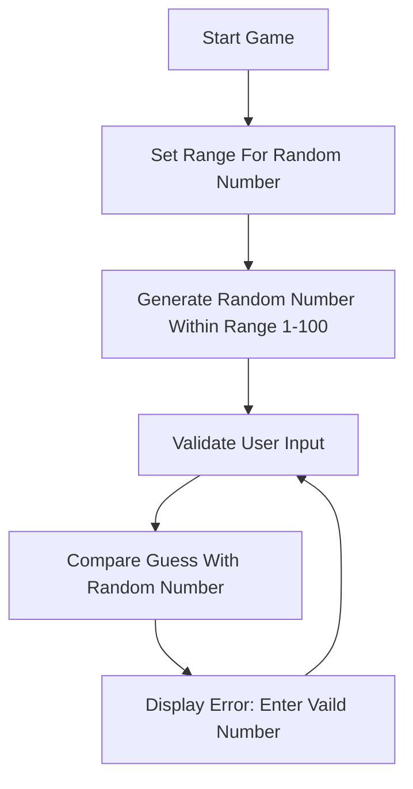

```mermaid
flowchart TD;
    A[Start Game] --> B[Set Range For Random Number];
    B --> C[Generate Random Number Within Range 1-100];
    C --> D[Validate User Input];
    D --> E[Compare Guess With Random Number];
    E --> F[Display Error: Enter Vaild Number];
    F --> D;
    
```
title: Number Guessing Game
